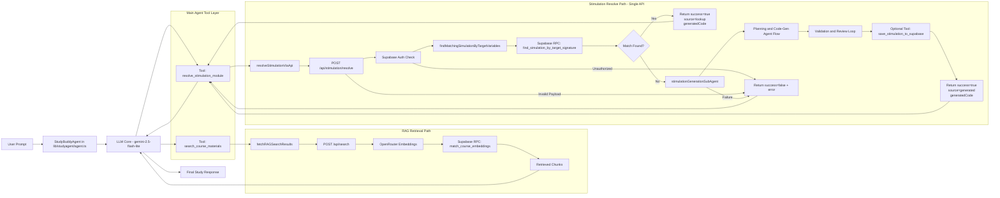

# StudyBuddy Agent Tools And Subagent Flow

```mermaid
flowchart LR
    U[User Prompt]
    SA[StudyBuddyAgent in lib/studyagent/agent.ts]
    M[LLM Core - gemini-2.5-flash-lite]

    U --> SA
    SA --> M

    subgraph MainTools[Main Agent Tool Layer]
      T1[Tool: search_course_materials]
      T2[Tool: resolve_stimulation_module]
    end

    M --> T1
    M --> T2

    subgraph RAGPath[RAG Retrieval Path]
      R1[fetchRAGSearchResults]
      R2[POST /api/search]
      R3[OpenRouter Embeddings]
      R4[Supabase RPC: match_course_embeddings]
      R5[Retrieved Chunks]
    end

    T1 --> R1 --> R2 --> R3 --> R4 --> R5 --> M

    subgraph ResolvePath[Stimulation Resolve Path - Single API]
      C1[resolveStimulationViaApi]
      A1[POST /api/stimulation/resolve]
      A2[Supabase Auth Check]
      L1[findMatchingSimulationByTargetVariables]
      L2[Supabase RPC: find_simulation_by_target_signature]
      D1{Match Found?}
      OK1[Return success=true\nsource=lookup\ngeneratedCode]
      G1[stimulationGenerationSubAgent]
      G2[Planning and Code-Gen Agent Flow]
      G3[Validation and Review Loop]
      G4[Optional Tool: save_stimulation_to_supabase]
      OK2[Return success=true\nsource=generated\ngeneratedCode]
      ERR[Return success=false + error]
    end

    T2 --> C1 --> A1 --> A2 --> L1 --> L2 --> D1
    D1 -- Yes --> OK1
    D1 -- No --> G1 --> G2 --> G3 --> G4 --> OK2

    A2 -- Unauthorized --> ERR
    A1 -- Invalid Payload --> ERR
    G1 -- Failure --> ERR

    OK1 --> T2
    OK2 --> T2
    ERR --> T2

    T2 --> M
    M --> RESP[Final Study Response]
```
