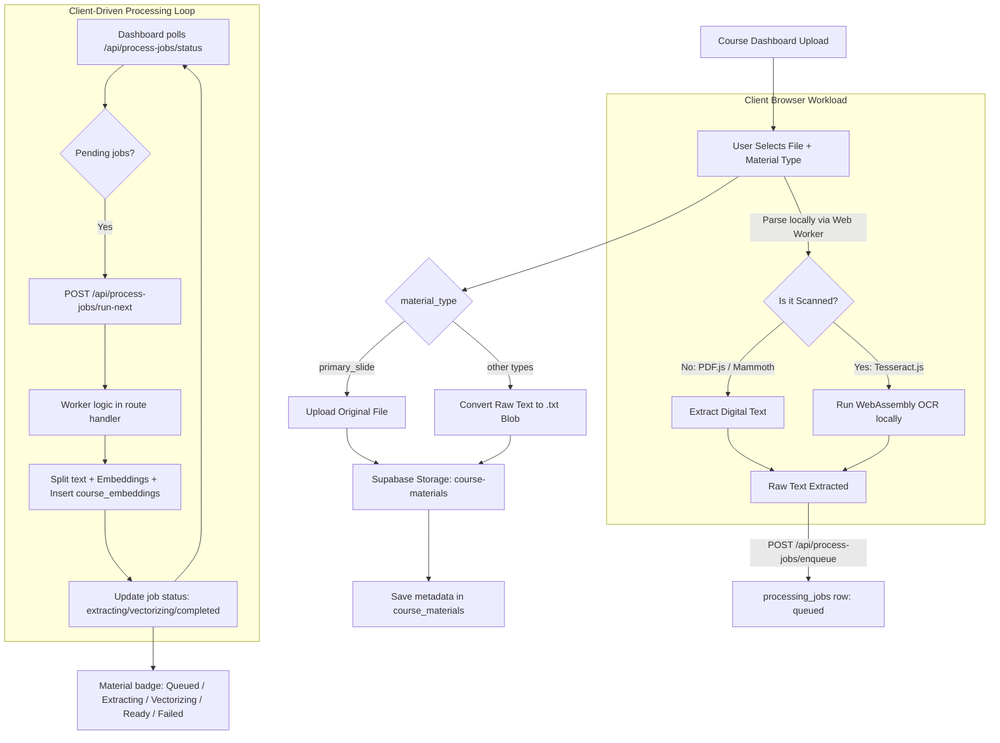
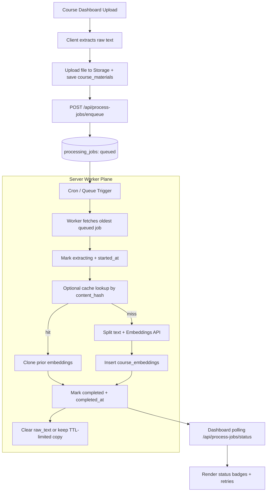

# Document Ingestion & Embedding Pipeline

This document shows both:
- the **current implementation** (async queue with client-triggered polling), and
- the **target production architecture** (server-side worker).

## 1) Current Implementation (Async Queue + Client Trigger)

### Summary (Current)
- Upload returns quickly after file save + enqueue.
- Users can leave the page and return; status is persisted in `processing_jobs`.
- Dashboard polling provides coarse milestones and ETA range.
- Current limitation: processing is still kicked by client traffic (`run-next` calls).

## 2) Target Production Architecture (Server-Side Worker)

### Summary (Server-Side Worker)
- Client is fully decoupled from long-running embedding work.
- Processing continues even if user closes browser.
- Better reliability, throughput, and cost control (concurrency + retry policy).
- Recommended for production with large files and many concurrent users.

## 3) Migration Plan (Current → Server Worker)

1. **Prepare worker path (no cutover yet)**
    - Deploy server-side worker trigger (cron/queue) that calls the same processing logic.
    - Keep current client-triggered `run-next` flow active.

2. **Add idempotency guardrails**
    - Enforce single active job per `material_id`.
    - Keep `content_hash` reuse enabled to avoid duplicate embedding cost.

3. **Shadow run in low traffic window**
    - Let server worker process new `queued` jobs while client fallback still exists.
    - Compare success rate, average completion time, and failure reasons for 24–48 hours.

4. **Soft cutover**
    - Stop client from calling `run-next` automatically.
    - Keep dashboard polling/status unchanged (UI stays stable for users).

5. **Stabilization + rollback window**
    - Monitor queue depth, retries, and failed jobs.
    - If error rate spikes, re-enable client trigger temporarily as fallback.

6. **Finalize**
    - Remove client-triggered worker loop.
    - Keep enqueue + status endpoints and server worker as the only processing path.
