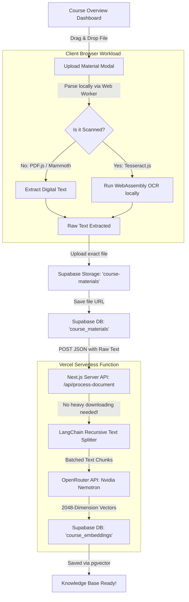

# Document Ingestion & Embedding Pipeline

This chart maps out the zero-budget document vectorization pipeline we just built for the `course_embeddings` knowledge base.

```mermaid
flowchart TD
    A[Course Overview Dashboard] -->|Drag & Drop File| B[Upload Material Modal]
    
    subgraph Client Browser Workload
    B -->|Parse locally via Web Worker| C{Is it Scanned?}
    C -->|No: PDF.js / Mammoth| D[Extract Digital Text]
    C -->|Yes: Tesseract.js| E[Run WebAssembly OCR locally]
    D --> F[Raw Text Extracted]
    E --> F
    end
    
    F -->|Upload exact file| G[Supabase Storage: 'course-materials']
    G -->|Save file URL| H[Supabase DB: 'course_materials']
    H -->|POST JSON with Raw Text| I[Next.js Server API: /api/process-document]
    
    subgraph Vercel Serverless Function
    I -->|No heavy downloading needed!| J[LangChain Recursive Text Splitter]
    J -->|Batched Text Chunks| K[OpenRouter API: Nvidia Nemotron]
    K -->|2048-Dimension Vectors| L[Supabase DB: 'course_embeddings']
    end
    
    L -->|Saved via pgvector| M[Knowledge Base Ready!]
```
