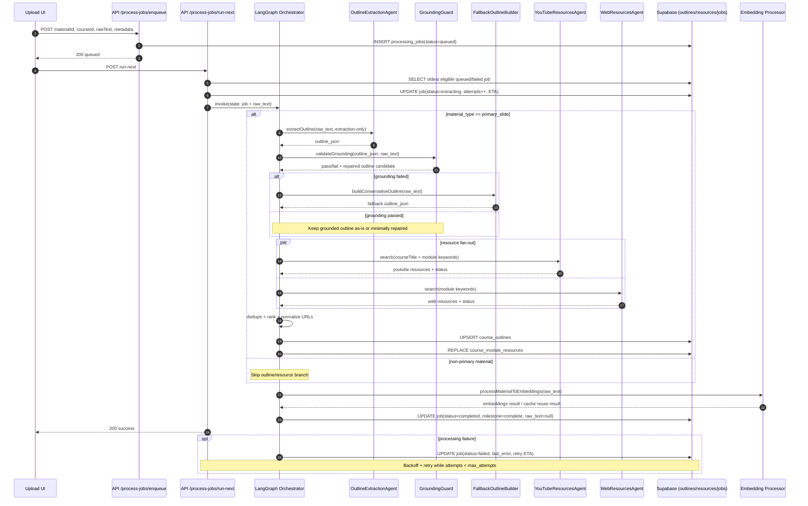

# LangGraph Agent Orchestration Flow

```mermaid
flowchart TD
    %% =========================
    %% ENTRY + INGESTION
    %% =========================
    A0([User uploads material]) --> A1[API: process-jobs/enqueue\nPersist job row: queued\nStore raw_text + metadata]
    A1 --> A2[API: process-jobs/run-next\nSelect oldest eligible queued/failed job]
    A2 --> A3{Auth + ownership valid?}
    A3 -- No --> A3E[[Stop: Unauthorized / invalid job]]
    A3 -- Yes --> A4[Mark job extracting\nSet milestone + ETA\nIncrement attempts]

    %% =========================
    %% ORCHESTRATOR START
    %% =========================
    A4 --> O0[LangGraph Orchestrator START\nState includes job, raw_text, course_id, material_id, and statuses]
    O0 --> O1{Material type is primary_slide?}

    %% =========================
    %% PRIMARY OUTLINE BRANCH
    %% =========================
    O1 -- Yes --> O2[Node: OutlineExtractionAgent\nInput: uploaded raw_text\nPrompt: extraction-only, no invention]
    O2 --> O3[Node: GroundingGuard\nValidate title/overview/modules against source text\nFilter/repair weakly grounded fields]
    O3 --> O4{Grounding pass?}

    O4 -- No --> O5[Node: FallbackOutlineBuilder\nDerive modules from explicit text lines\nProduce conservative structure only]
    O5 --> O6[Node: Set outline state]

    O4 -- Yes --> O6[Node: Set outline state]

    O6 --> O7[Parallel fan-out via orchestrator]
    O7 --> Y1[Node: YouTubeResourcesAgent\nQuery from orchestrator keywords\nCollect top N videos/module]
    O7 --> W1[Node: WebResourcesAgent\nSearch web resources from same keywords\nCollect and score links/module]

    Y1 --> M1[Node: MergeResourceResults\nNormalize URL\nDedupe\nRank by relevance]
    W1 --> M1

    M1 --> P1[Node: Persist outline\nUpsert course_outlines]
    P1 --> P2[Node: Persist resources\nReplace course_module_resources]

    %% =========================
    %% EMBEDDING BRANCH (ALL MATERIAL TYPES)
    %% =========================
    O1 -- No --> E0[Skip outline branch]
    P2 --> E1[Node: TryReuseCachedEmbeddings\nReuse by content_hash if prior completed exists]
    E0 --> E1

    E1 --> E2{Cache hit?}
    E2 -- Yes --> E5[Node: Reused embeddings linked to material]
    E2 -- No --> E3[Node: processMaterialToEmbeddings\nChunk text + vectorize]
    E3 --> E4[Node: Persist embeddings rows]
    E4 --> E5

    %% =========================
    %% FINALIZATION + ERROR HANDLING
    %% =========================
    E5 --> F1[Mark job completed\nstatus=completed\nmilestone=complete\nclear raw_text]
    F1 --> F2([END success])

    O0 --> X0{Unhandled runtime error?}
    O2 --> X0
    O3 --> X0
    O5 --> X0
    Y1 --> X0
    W1 --> X0
    E3 --> X0

    X0 -- Yes --> X1[Mark job failed\nSet last_error\nSet retry ETA]
    X1 --> X2{attempts < max_attempts?}
    X2 -- Yes --> X3[[Backoff then eligible for retry]]
    X2 -- No --> X4[[Terminal failure\nmanual retry required]]

    %% =========================
    %% OBSERVABILITY / UI
    %% =========================
    F1 -. updates .-> U1[UI polling status badges\nQueued -> Extracting -> Vectorizing -> Ready]
    X1 -. updates .-> U1

    %% =========================
    %% STYLE
    %% =========================
    classDef orchestrator fill:#eef2ff,stroke:#4f46e5,color:#1f2937,stroke-width:1.2px;
    classDef agent fill:#ecfdf5,stroke:#059669,color:#1f2937,stroke-width:1.1px;
    classDef guard fill:#fff7ed,stroke:#ea580c,color:#1f2937,stroke-width:1.1px;
    classDef persist fill:#f8fafc,stroke:#334155,color:#1f2937,stroke-width:1.1px;
    classDef error fill:#fef2f2,stroke:#dc2626,color:#1f2937,stroke-width:1.1px;

    class O0,O1,O7 orchestrator;
    class O2,Y1,W1,E3 agent;
    class O3,O4,O5 guard;
    class P1,P2,E4,F1 persist;
    class X0,X1,X2,X3,X4 error;
```

## Notes

- Orchestrator always controls call order and fan-out.
- OutlineExtractionAgent is constrained to extraction-only behavior.
- GroundingGuard prevents hallucination by checking if generated fields are supported by uploaded text.
- FallbackOutlineBuilder ensures structured output even when source text is noisy.
- Resource agents (YouTube + Web) receive keywords from orchestrator, not free-form generation.
- Existing status polling in UI remains compatible with this flow.

## Sequence Diagram (Message-Level)

