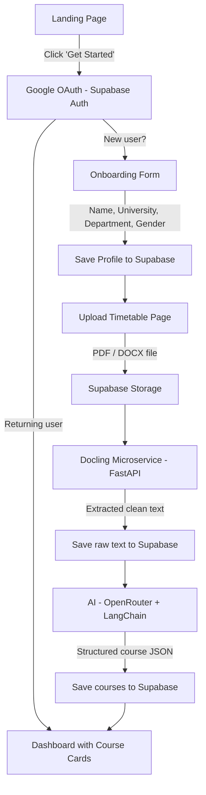

# StudyBuddy — Onboarding System Architecture Plan

## Overview

Build the onboarding pipeline that takes a new student from sign-up to a fully populated course dashboard.

```
Landing Page → Google OAuth → Profile Form → Upload Timetable → Parse → AI → Course Cards → Dashboard
```

---

## System Architecture



---

## Phase 1: Authentication

| Item | Detail |
|---|---|
| **Provider** | Google OAuth via Supabase Auth |
| **Flow** | Click "Get Started" → Google popup → Redirect to `/onboarding` (new) or `/dashboard` (returning) |
| **Session** | Supabase handles JWT sessions, accessed via `@supabase/ssr` in Next.js |
| **Middleware** | Next.js middleware checks auth state → redirects unauthenticated users to landing page |

### Files to Create
- `lib/supabase/client.ts` — Browser Supabase client
- `lib/supabase/server.ts` — Server-side Supabase client
- `middleware.ts` — Auth route protection
- `app/auth/callback/route.ts` — OAuth callback handler

---

## Phase 2: Profile Onboarding

Simple form shown only on first login (when no profile exists).

### Fields
| Field | Type | Required |
|---|---|---|
| Full Name | text | ✅ |
| University | text | ✅ |
| Department | text | ✅ |
| Gender | select | ✅ |

### Files to Create
- `app/onboarding/page.tsx` — Onboarding form page
- `app/api/profile/route.ts` — API route to save profile

---

## Phase 3: Timetable Upload & Parsing

### Upload Flow
1. Student uploads a PDF or DOCX file
2. File is stored in **Supabase Storage** (`timetables` bucket)
3. Next.js API route sends the file to the **Docling microservice**
4. Docling extracts clean text and returns it
5. Raw extracted text is saved to Supabase (`raw_documents` table)

### Docling Microservice (Python)
| Item | Detail |
|---|---|
| **Framework** | FastAPI |
| **Endpoint** | `POST /parse` — accepts file, returns extracted text |
| **Supported formats** | PDF, DOCX |
| **Deployment** | Railway or Render (free tier) |

### Files to Create
- `app/onboarding/upload/page.tsx` — Upload UI
- `app/api/upload/route.ts` — Handles file upload → Storage → Docling → save raw text
- `docling-service/` — Separate Python repo/folder for the FastAPI service

---

## Phase 4: AI Course Extraction

### Pipeline
1. Fetch raw extracted text from Supabase
2. Send to OpenRouter AI via LangChain with a structured output prompt
3. AI returns a JSON array of course objects
4. Save structured courses to Supabase (`courses` table)

### Expected AI Output
```json
{
  "courses": [
    {
      "code": "CSC301",
      "title": "Operating Systems",
      "day": "Monday",
      "time": "10:00 - 12:00",
      "venue": "LT1"
    }
  ]
}
```

### Files to Create
- `lib/ai/extract-courses.ts` — LangChain + OpenRouter logic
- `app/api/extract/route.ts` — API route that triggers AI extraction

---

## Database Schema (Supabase)

```sql
-- User profiles (linked to Supabase Auth)
profiles
├── id (uuid, FK → auth.users.id)
├── full_name (text)
├── university (text)
├── department (text)
├── gender (text)
├── onboarding_complete (boolean, default false)
├── created_at (timestamptz)
└── updated_at (timestamptz)

-- Uploaded documents
raw_documents
├── id (uuid, PK)
├── user_id (uuid, FK → profiles.id)
├── file_url (text) — Supabase Storage URL
├── file_type (text) — 'pdf' | 'docx'
├── extracted_text (text) — parsed output from Docling
├── document_type (text) — 'timetable' | 'academic_calendar'
└── created_at (timestamptz)

-- AI-extracted courses
courses
├── id (uuid, PK)
├── user_id (uuid, FK → profiles.id)
├── document_id (uuid, FK → raw_documents.id)
├── code (text)
├── title (text)
├── day (text)
├── time_slot (text)
├── venue (text, nullable)
└── created_at (timestamptz)
```

---

## Caching Strategy

| Layer | Method | Purpose |
|---|---|---|
| **Client-side** | React Query (`@tanstack/react-query`) | Cache course data, profile data — avoid refetching on every page navigation |
| **Server-side** | Next.js `unstable_cache` or `fetch` cache | Cache AI responses and parsed text on the server |
| **No Redis** | Deferred | Only introduce if scale demands it |

---

## Rollout Order

| Step | What | Depends On |
|---|---|---|
| **1** | Supabase project setup (Auth, DB schema, Storage bucket) | — |
| **2** | Auth flow (Google OAuth + middleware + callback) | Step 1 |
| **3** | Profile onboarding form + API | Step 2 |
| **4** | Docling microservice (Python FastAPI, deploy to Railway) | — (parallel) |
| **5** | Timetable upload page + API (Storage + Docling call) | Steps 3 & 4 |
| **6** | AI course extraction (LangChain + OpenRouter) | Step 5 |
| **7** | Course cards UI + Dashboard page | Step 6 |

> [!NOTE]
> Steps 1-3 (Auth + Profile) and Step 4 (Docling service) can be built **in parallel** since they're independent.

---

## Open Questions

1. **Docling deployment** — Do you have a Railway/Render account, or should we use a different host?
2. **OpenRouter API key** — Do you have one ready, or need to set up an account?
3. **Academic calendar** — Since it's optional, should we build it in Phase 1 or defer?
4. **Course editing** — After AI generates courses, should students be able to manually edit/delete/add courses before confirming?
