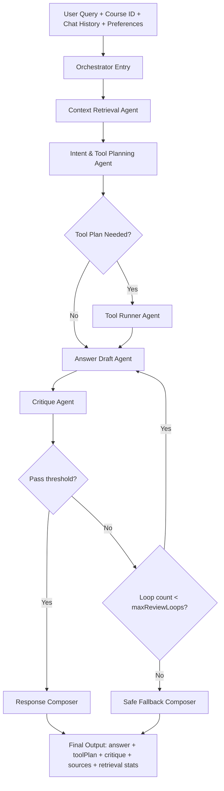
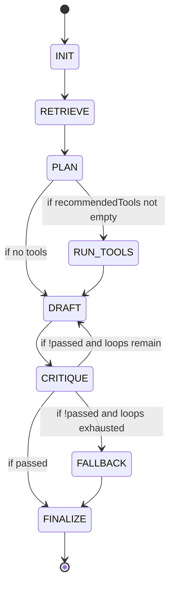
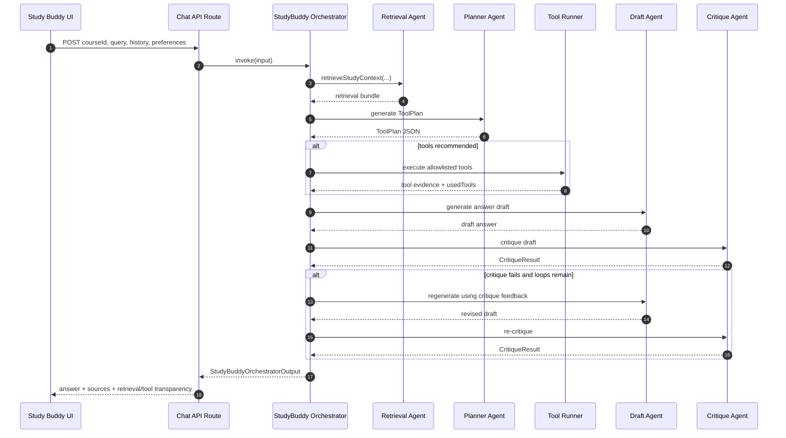

# Study Buddy System Flow (Design-First)

## 1) Objective

Design a production-ready **Study Buddy multi-agent system** for a course workspace that:
- answers learner questions grounded in uploaded course materials,
- uses an explicit **tool plan** before response generation,
- runs a review loop (critique + repair) when quality is low,
- emits traceable outputs (sources, reasoning mode, confidence, and retrieval stats),
- stays compatible with the existing ingestion + embedding pipeline.

This document is a **design/spec only** (no implementation yet).

---

## 2) Existing System Context (What we already have)

From the current codebase:
- Retrieval contracts already exist in `lib/ai/study-buddy/types.ts`:
  - `ToolPlan`, `CritiqueResult`, `StudyBuddyOrchestratorInput`, `StudyBuddyOrchestratorOutput`
- Retrieval pipeline exists in `lib/ai/study-buddy/retriever.ts`:
  - material retrieval = vector + keyword hybrid
  - conversation retrieval = keyword ranking over recent chat
  - dedupe + score sort
- In-memory retrieval cache exists in `lib/ai/study-buddy/cache.ts`:
  - TTL: 60s (`RETRIEVAL_TTL_MS = 60_000`)
- Course material processing + embeddings/job status already exists in the current ingestion flow docs and APIs.

So the missing layer is the **Study Buddy orchestrator + agent prompts + tool execution policy**.

---

## 3) Target Architecture (High-Level)

---

## 4) Agent Responsibilities

## 4.1 Context Retrieval Agent
Inputs:
- `courseId`, `query`, `conversationHistory`

Responsibilities:
- call retrieval bundle (`materialHits`, `conversationHits`, `usedCache`)
- enforce retrieval limits and sorting
- return normalized context pack for downstream agents

Output:
- ranked context snippets with retrieval mode labels
- retrieval stats summary

---

## 4.2 Intent & Tool Planning Agent
Inputs:
- user query
- retrieved context
- user preferences

Responsibilities:
- classify answer mode:
  - `explain`
  - `step-by-step`
  - `quiz`
  - `mixed`
- produce `ToolPlan`:
  - `recommendedTools`
  - `answerMode`
  - `rationale`
  - `confidence` (0..1)
- avoid over-tooling when retrieval confidence is already high

Output:
- deterministic tool plan object (strict schema)

---

## 4.3 Tool Runner Agent
Inputs:
- tool plan
- context pack

Responsibilities:
- execute only allowlisted tools for this environment
- collect tool outputs and normalize to evidence blocks
- enforce tool budget (max tool calls / timeout)

Output:
- `usedTools`
- tool evidence blocks (compact)

---

## 4.4 Answer Draft Agent
Inputs:
- query
- context pack
- tool evidence
- preferences (style, tone, latex, quiz toggle)

Responsibilities:
- generate grounded answer
- cite supporting snippets internally for critique/composer
- follow selected answer mode
- refuse or qualify unsupported claims

Output:
- `StudyBuddyDraft { answer, usedTools }`

---

## 4.5 Critique Agent
Inputs:
- draft answer
- context pack
- tool plan

Responsibilities:
- evaluate grounding, completeness, clarity, and mode fit
- compute `CritiqueResult`:
  - `passed`
  - `score`
  - `feedback`
- give actionable repair hints if failed

Output:
- critique object + repair instructions

---

## 4.6 Response Composer
Inputs:
- final approved draft
- tool plan
- critique
- retrieval bundle

Responsibilities:
- shape final `StudyBuddyOrchestratorOutput`
- attach source snippets with material metadata
- provide transparent retrieval/tool stats

Output:
- API-ready response object for UI consumption

---

## 5) Orchestrator State Machine

Loop policy:
- default `maxReviewLoops = 2`
- hard cap `maxReviewLoops <= 4`
- each loop must incorporate critique feedback delta (no blind retry)

---

## 6) Tool Planning Design

## 6.1 Tool Categories
Planned categories (you will provide exact tool details later):
- **retrieval tools** (already available)
- **reasoning helpers** (e.g., structure builder / step organizer)
- **assessment tools** (quiz/check understanding)
- **formatting tools** (latex/flashcard shaping)

## 6.2 Selection Heuristics
- Prefer `no extra tools` if retrieval coverage is sufficient.
- Trigger tools when query requires:
  - computation/derivation,
  - structured study artifacts,
  - gap-checking or quiz generation,
  - ambiguity resolution.

## 6.3 Confidence Policy
- `toolPlan.confidence >= 0.75`: execute plan directly
- `0.45 <= confidence < 0.75`: execute minimal subset + warn internally
- `< 0.45`: skip heavy tools, produce conservative answer + ask clarifying follow-up

---

## 6.4 Tool-by-Tool Design (Start: Visualization Tool)

### Visualization Tool (v1 deterministic)

Purpose:
- produce renderable study visuals from a learner query without needing LLM generation.

Supported modes:
- `graph`
- `chart`
- `flowchart`
- `diagram`

Selection logic (deterministic):
- if `ToolExecutionStep.input.visualType` is provided and valid, use it.
- else infer from query keywords:
  - process/pipeline/flow -> `flowchart`
  - trend/distribution/compare/percentage -> `chart`
  - relationship/network/connect -> `graph`
  - default -> `diagram`

Output contract (normalized tool output):
- `mode`: selected visualization mode
- `title`: visualization title
- `rationale`: why this mode was selected
- `renderHints`: renderer preferences (mermaid + fallback)
- `mermaid`: renderable Mermaid string
- `examples`: mode examples with use-cases

Initial examples covered:
- Graph tool example: concept relationship map
- Chart tool example: concept metric comparison
- Flowchart tool example: input -> process -> output sequence
- Diagram tool example: high-level mindmap

---

## 7) Prompt System (Draft Scaffolds)

> These are intentionally scaffolds; we will replace with your final prompt text once you send full tool details.

## 7.1 System Prompt (Global)
- Role: course-grounded study assistant
- Hard rules:
  - do not invent facts not supported by retrieved/tool evidence
  - be explicit when uncertain
  - adapt format to `answerMode`
  - respect user preferences (`responseStyle`, `tone`, `includeMathLatex`, `includeQuizWhenHelpful`)

## 7.2 Planner Prompt
- Input: query + retrieval summaries + preferences
- Output: strict JSON `ToolPlan`
- Constraints:
  - only allowlisted tool names
  - rationale must reference query intent + evidence availability

## 7.3 Draft Prompt
- Input: query + top snippets + tool evidence + mode
- Output: answer body only
- Constraints:
  - prioritized by groundedness over creativity
  - concise for `responseStyle=concise`, expanded for `detailed`

## 7.4 Critique Prompt
- Input: draft + query + context + mode
- Output: strict JSON `CritiqueResult`
- Scoring axes:
  - factual grounding
  - answer completeness
  - mode adherence
  - pedagogical quality

---

## 8) Data Contracts (Aligned with existing types)

`StudyBuddyOrchestratorInput`
- `courseId: string`
- `query: string`
- `conversationHistory: StudyBuddyChatMessage[]`
- `userPreferences?: StudyBuddyUserPreferences`
- `maxReviewLoops?: number`

`StudyBuddyOrchestratorOutput`
- `answer: string`
- `toolPlan: ToolPlan`
- `critique: CritiqueResult`
- `iterations: number`
- `sources: [{ materialId?, materialTitle?, snippet, retrievalMode }]`
- `retrieval: { materialCount, conversationCount, usedCache }`

---

## 9) Failure & Safety Behavior

If retrieval is empty:
- return a constrained fallback:
  - acknowledge low context
  - ask one high-value clarifying question
  - suggest uploading relevant material if appropriate

If tool execution fails:
- keep responding using retrieval-only evidence
- include internal error note for logs (not user-facing stack traces)

If critique repeatedly fails:
- return best safe answer + explicit uncertainty + short next step suggestion

---

## 10) Observability & Telemetry

Per request, log:
- request id / course id
- retrieval latency + counts
- planner latency + toolPlan confidence
- tool execution latency + tool errors
- critique scores and loop count
- final response latency

Quality tracking dashboard metrics:
- critique pass rate
- avg loops per request
- % responses with tools vs no tools
- empty-retrieval rate
- user follow-up rate (proxy for answer quality)

---

## 11) End-to-End Sequence (Design)

---

## 12) Rollout Plan (No-code phases)

Phase A — Design lock:
- finalize tool catalog + planner policy
- finalize all agent prompts

Phase B — Skeleton wiring:
- implement orchestrator shell with mocked tool runner
- wire output contract to UI

Phase C — Tool integration:
- attach real tools with allowlist + budget
- add telemetry

Phase D — Quality tuning:
- calibrate critique thresholds + loop counts
- tune retrieval chunk limits and planner confidence thresholds

---

## 13) Design Inputs Captured (March 23, 2026)

This section logs the latest design constraints and tool definitions provided by product direction.
No runtime implementation is included yet.

## 13.1 Full Tool Catalog (Name • Input • Output • Latency)

### Core Intelligence
- `planner_tool`
  - input: `user_goal`, `context`, `history`
  - output: `structured_plan` (steps + tools to call)
  - target latency: `300–800ms`
  - note: must remain fast due to frequent invocation
- `retrieval_tool` (RAG)
  - input: `query`, `filters` (`subject`, `difficulty`)
  - output: `documents`, `citations`
  - target latency: `200–600ms`
- `memory_tool`
  - input: `user_id`, `interaction`
  - output: stored/retrieved memory
  - target latency: `<200ms`

### Visualization
- `graph_tool`
  - input: `equation` (LaTeX), `range`
  - output: interactive graph
  - target latency: `300–1000ms`
- `chart_tool`
  - input: `dataset`, `chart_type`
  - output: chart (pie/histogram/etc.)
  - target latency: `300–800ms`
- `flowchart_tool`
  - input: `process_description`
  - output: flowchart (`nodes`, `edges`)
  - target latency: `500–1200ms`
- `diagram_tool`
  - input: `type` (circuit/system), `components`
  - output: structured diagram
  - target latency: `700–1500ms`

### Mathematical
- `math_solver_tool`
  - input: `problem` (LaTeX/text)
  - output: step-by-step solution
  - target latency: `500–1500ms`
- `symbolic_tool`
  - input: `expression`
  - output: simplified / derivative / integral expression
  - target latency: `300–1000ms`

### Simulation
- `simulation_tool`
  - input: `model_type`, `parameters`
  - output: interactive simulation
  - target latency: `800–2000ms`

### Explanation
- `animation_tool`
  - input: `concept`, `steps`
  - output: animation / frames
  - target latency: `1–3s` (can be async)
- `whiteboard_tool`
  - input: `explanation_steps`
  - output: visual teaching sequence
  - target latency: `500–1200ms`

### Active Learning
- `quiz_tool`
  - input: `topic`, `difficulty`
  - output: questions + answers
  - target latency: `300–800ms`
- `flashcard_tool`
  - input: `notes` / `topic`
  - output: flashcards
  - target latency: `200–600ms`
- `spaced_repetition_tool`
  - input: `performance_data`
  - output: review schedule
  - target latency: `<200ms`
- `assessment_tool`
  - input: learner answers
  - output: score + feedback
  - target latency: `200–500ms`

### Content Generation
- `slides_tool`
  - input: `topic`, `depth`
  - output: structured slides
  - target latency: `800–2000ms`
- `notes_tool`
  - input: content block
  - output: summarized notes
  - target latency: `300–800ms`

### Search
- `search_tool`
  - input: query
  - output: web results
  - target latency: `300–1000ms`
- `image_search_tool`
  - input: concept
  - output: images
  - target latency: `500–1200ms`

### Meta / Quality
- `understanding_tracker`
  - input: interactions, scores
  - output: mastery level
  - target latency: `<200ms`
- `critique_tool`
  - input: generated response
  - output: quality score + improvements
  - target latency: `300–700ms`

## 13.2 Mandatory vs Optional Scope

### Mandatory (MVP Core)
- `planner_tool`
- `retrieval_tool`
- `memory_tool`
- `math_solver_tool`
- `quiz_tool`
- `flashcard_tool`
- `understanding_tracker`
- `critique_tool`

### High Value (Phase 2)
- `graph_tool`
- `simulation_tool`
- `flowchart_tool`
- `slides_tool`

### Optional / Differentiation (Phase 3)
- `animation_tool`
- `diagram_tool`
- `image_search_tool`
- `whiteboard_tool`

## 13.3 Hard Policy Rules (Non-Negotiable)

The Study Buddy system must never:
- Fake learner understanding without measurable evidence (quiz/performance data).
- Skip reasoning in educational contexts (except explicit exam mode).
- Hallucinate facts; if uncertain, explicitly state uncertainty and verify.
- Overwhelm learners with unstructured long-form dumps.
- Ignore learner level; difficulty must adapt dynamically.
- Use tools unnecessarily (e.g., graphing for trivial arithmetic).
- Break learning flow by jumping topics without transition.

## 13.4 Critique Threshold Policy

### Default Recommendation
- production-balanced target threshold: `0.8`

### Score Bands
- `<0.6` → reject
- `0.6–0.79` → revise
- `>=0.8` → deliver

### Launch Strategy
- start at `0.75` for faster iteration
- raise to `0.8+` after stability and quality tuning
- premium-quality profile can use `0.85+`

## 13.5 Ambiguous Query Default Mode

Default: **Guided Clarification Mode**

Behavior sequence:
1. Interpret and state likely intent ("you may be asking about X").
2. Provide partial value immediately (short baseline explanation).
3. Ask a targeted next-step choice question (e.g., deep explanation vs examples vs practice).

Must avoid:
- vague clarifying prompts such as generic "can you clarify?"

Must enforce:
- always move learning forward even when ambiguity exists.

## 13.6 Status

Captured and accepted as current design baseline.
Next design pass will define the detailed scope/behavior contract for each tool before implementation.
